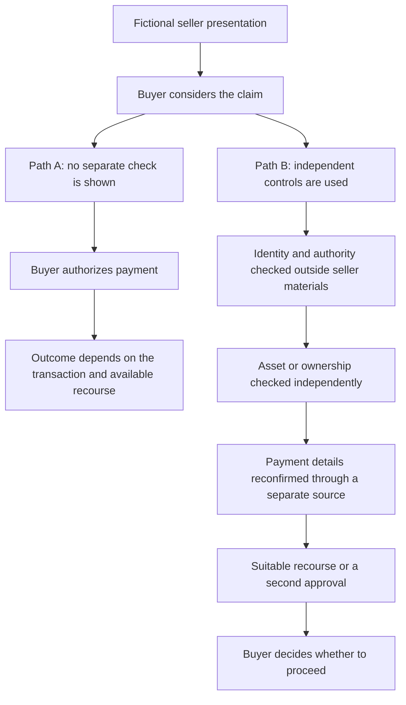

# From task capability to outcome

This is a companion to ["The Floor is Falling - Task by Task"](https://www.linkedin.com/pulse/floor-falling-task-lee-payton-ciu4c), published Sept. 13, 2026. It carries one question into the [evidence-led methodology](../METHODOLOGY.md): which task changed, what supports that claim, and what still stands between it and a consequential outcome?

The lens does not determine whether any person used AI, detect AI-enabled fraud, or validate the article's argument. Use it to organize claims, limits, and human review. The [synthetic example](../SYNTHETIC-EXAMPLE.md) shows how to keep observation, inference, alternatives, and disposition separate.

## Match the evidence to the claim

Experiments, operational reports, and market cases answer different questions. Keep the claim narrow enough that its source can support it.

| Evidence type | It can support | It does not establish on its own |
|---|---|---|
| Controlled experiment | A result on the tasks, people, tools, and conditions actually studied | That the same effect appears in fraud operations, or that a real-world outcome followed |
| Operational or threat-intelligence report | What the reporting organization says it observed in a stated context | General prevalence, a measured capability gain, or downstream loss unless the source measured those things |
| Market or case record | Facts documented about a transaction, representation, asset, control, or outcome in that record | AI use or AI causation unless the record establishes it |

The article's selected primary sources illustrate these differences:

| Type | Sources cited in the article | Keep in view |
|---|---|---|
| Experiment | [Noy and Zhang, *Science* (2023)](https://doi.org/10.1126/science.adh2586); [Aguirre et al., RAND (2026)](https://doi.org/10.7249/RRA3892-1) | Read the tested task and study limits; do not transfer a result to an untested operation. |
| Operational report | [FBI/IC3 public service announcement (Dec. 3, 2024)](https://www.ic3.gov/PSA/2024/PSA241203); [Google Threat Intelligence Group (Sept. 9, 2026)](https://cloud.google.com/blog/topics/threat-intelligence/from-prompting-to-autonomy-the-evolution-of-adversarial-ai) | Attribute the observation to its reporting source and scope. A reported use is not a measure of its effect on a transaction. |
| Market or case record | [Consumer Protection Western Australia (Dec. 20, 2024)](https://www.consumerprotection.wa.gov.au/announcements/commissioners-blog-scammed-the-farm-gate-how-spot-fake-machinery-deals); [U.S. Attorney's Office, Southern District of Georgia (Mar. 11, 2026)](https://www.justice.gov/usao-sdga/pr/romanian-national-sentenced-prison-defrauding-farmers-phony-equipment-sales) | Use the underlying record for the documented transaction facts. Do not infer AI use from a case's resemblance to a task-capability claim. |

These are examples already cited by the article, not a complete bibliography or independent confirmations of its full argument. Follow each link to the original source. Record the source, publication and observation dates, scope, and lineage; multiple retellings of one report remain one source lineage. For complaint statistics, an "AI-related" descriptor is not a finding that AI caused the reported loss; see the [2025 IC3 Annual Report](https://www.ic3.gov/AnnualReport/Reports/2025_IC3Report.pdf) and the article's discussion of its limits.

## Trace the task-to-outcome link

For each proposed claim, fill in the evidence before drawing a conclusion:

- **Task:** Which bounded task changed: research, writing, translation, correspondence, coordination, or another task?
- **Change:** What specifically became easier, faster, more consistent, or did not improve? What is directly observed, and what is inferred?
- **Evidence:** Is the support an experiment, an operational report, or a market/case record? Record its source ID, original reference, publication date, observation date, and lineage.
- **Limit:** What does that evidence leave unknown? Do not move from a task result to a claim about deployment, conversion, or loss without evidence for those links.
- **Dependencies and controls:** What still needs a person, service, account, asset, authority, logistics, or a consequential decision? Who controls each one? Which checks can verify the claim outside the presenting party's materials?
- **Alternatives:** Could the same result reflect existing templates, copied content, human expertise, a vendor, or ordinary process changes? What evidence could distinguish these explanations?
- **Review:** What remains uncertain, and what disposition does a human reviewer record?

Use the workbench's [relationship brief](../workbench/templates/linkage-brief.md) when the claim concerns trust or linkage. It has space for observations, source lineages, capture gaps, freshness, alternatives, and disposition.

## Capability-to-Outcome Distance is a question

The article uses Capability-to-Outcome Distance (COD) as a way to ask what barriers remain after a task becomes possible or easier. It is not a score, rating, threshold, or prediction. Discuss it in plain language:

1. What capability or task is supported by the evidence?
2. What must still happen before a consequential action?
3. Which dependencies or independent controls could interrupt that path?
4. Who performs or authorizes the final action, and what evidence supports that step?
5. What alternative explanation or missing observation could change the assessment?

## Fictional transaction path

The diagram is invented to show where a task-level change and transaction controls sit. Neither path represents a real buyer, seller, market, or incident. The added seller presentation is held constant; the paths differ in whether separate verification and recourse are present.

This is a discussion aid, not advice for every asset class or jurisdiction. A control only adds evidence or recourse when it is actually independent, appropriate, and used.

## Eight discussion prompts

The article closes with eight principles. These questions keep them tied to evidence:

1. Did an existing task become cheaper to perform, or is there evidence the underlying approach changed?
2. Which task changed, and which did not?
3. Was that task a bottleneck in the path being studied?
4. Did expertise disappear, or move into a model, tool, service, or workflow?
5. Who holds the authority or resource needed for the final action?
6. Do agreeing records have independent origins, or repeat one source across several surfaces?
7. What can be verified outside the representation, regardless of how it was produced?
8. After the capability works, what barriers remain between it and the outcome?

Keep claims source-grounded and human-reviewed. This guide adds no detector, score, target list, or collection step to the methodology.
