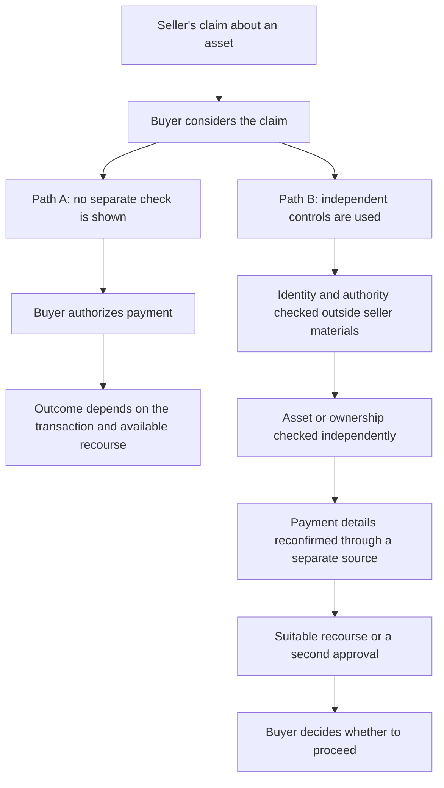

# From task capability to outcome

This companion to [“The Floor is Falling – Task by Task”](https://www.linkedin.com/pulse/floor-falling-task-lee-payton-ciu4c), published Sept. 13, 2026, asks one question: which task changed, what evidence supports that claim, and what remains between it and a consequential outcome? It connects that question to the [evidence-led methodology](../METHODOLOGY.md).

This lens does not determine whether anyone used AI, detect AI-enabled fraud, or validate the article’s claims. It helps organize evidence, limits, and human review. The [synthetic example](../SYNTHETIC-EXAMPLE.md) shows how to separate observation, inference, alternatives, and disposition.

## Match the evidence to the claim

Experiments, operational reports, and market or case records answer different questions. Keep each claim within what its source measured or recorded.

| Evidence type | It can support | It does not establish on its own |
|---|---|---|
| Controlled experiment | A result on the tasks, people, tools, and conditions actually studied | That the same effect appears in fraud operations, or that a real-world outcome followed |
| Operational or threat-intelligence report | What the reporting organization says it observed in a stated context | General prevalence, a measured capability gain, or downstream loss unless the source measured those things |
| Market or case record | Facts documented about a transaction, representation, asset, control, or outcome in that record | AI use or AI causation unless the record establishes it |

The article’s selected primary sources illustrate these differences:

| Type | Sources cited in the article | Keep in view |
|---|---|---|
| Experiment | [Noy and Zhang, *Science* (2023)](https://doi.org/10.1126/science.adh2586); [Aguirre et al., RAND (2026)](https://doi.org/10.7249/RRA3892-1) | Read the tested task and study limits; do not transfer a result to an untested operation. |
| Operational report | [FBI/IC3 public service announcement (Dec. 3, 2024)](https://www.ic3.gov/PSA/2024/PSA241203); [Google Threat Intelligence Group (Sept. 9, 2026)](https://cloud.google.com/blog/topics/threat-intelligence/from-prompting-to-autonomy-the-evolution-of-adversarial-ai) | Attribute the observation to its reporting source and scope. A reported use is not a measure of its effect on a transaction. |
| Market or case record | [Consumer Protection Western Australia (Dec. 20, 2024)](https://www.consumerprotection.wa.gov.au/announcements/commissioners-blog-scammed-the-farm-gate-how-spot-fake-machinery-deals); [U.S. Attorney’s Office, Southern District of Georgia (Mar. 11, 2026)](https://www.justice.gov/usao-sdga/pr/romanian-national-sentenced-prison-defrauding-farmers-phony-equipment-sales) | Use the cited source for the transaction details it reports; consult an underlying record if a claim requires it. Do not infer AI use from a case’s resemblance to a task-capability claim. |

These are examples already cited by the article, not a complete bibliography or independent confirmations of its full argument. Follow each link to the original source. Record the source, publication and observation dates, scope, and lineage; multiple retellings of one report remain one source lineage. For complaint statistics, an “AI-related” descriptor is not a finding that AI caused the reported loss; see the [2025 IC3 Annual Report](https://www.ic3.gov/AnnualReport/Reports/2025_IC3Report.pdf) and the article’s discussion of its limits.

## Trace the task-to-outcome link

For each proposed claim, fill in the evidence before drawing a conclusion:

- **Task:** Which bounded task changed: research, writing, translation, correspondence, coordination, or another task?
- **Change:** What specifically became easier, faster, more consistent, or did not improve? What is directly observed, and what is inferred?
- **Evidence:** Is the support an experiment, an operational report, or a market/case record? Record its source ID, original reference, publication date, observation date, and lineage.
- **Limit:** What does that evidence leave unknown? Do not move from a task result to a claim about deployment, conversion, or loss without evidence for those links.
- **Dependencies and controls:** What still needs a person, service, account, asset, authority, logistics, or a consequential decision? Who controls each one? Which checks can verify the claim outside the presenting party’s materials?
- **Alternatives:** Could the same result reflect existing templates, copied content, human expertise, a vendor, or ordinary process changes? What evidence could distinguish these explanations?
- **Review:** What remains uncertain, and what disposition does a human reviewer record?

For claims about relationships, common control, or linkage, use the workbench’s [relationship brief](../workbench/templates/linkage-brief.md). For broader task or transaction analysis, start with its [report template](../workbench/templates/report.md).

## Capability to Outcome Distance is a question

The article uses Capability to Outcome Distance (COD) as a way to ask what barriers remain after a task becomes possible or easier. It is not a score, rating, threshold, or prediction. Discuss it in plain language:

1. What capability or task is supported by the evidence?
2. What must still happen before a consequential action?
3. Which dependencies or independent controls could interrupt that path?
4. Who performs or authorizes the final action, and what evidence supports that step?
5. What alternative explanation or missing observation could change the assessment?

## Hypothetical transaction path

Suppose a buyer is considering a seller's claim about an asset. Both paths begin with that same claim and differ only in whether independent checks and recourse are used. The diagram illustrates possible review steps; it reports no actual buyer, seller, transaction, or outcome.

This is a discussion aid, not advice for every asset class or jurisdiction. A control only adds evidence or recourse when it is actually independent, appropriate, and used.

## Eight discussion prompts

These prompts follow the article’s eight principles. Work from the record in front of you and leave a question open when the evidence cannot answer it:

1. Start with what changed: did an existing task become cheaper, or does the evidence show a different underlying approach?
2. Name the task that changed and the tasks that stayed the same.
3. Was that task actually holding up the path you are studying?
4. Where does the expertise sit now—with a person, or in a model, tool, service, or workflow? Check whether it moved before saying it disappeared.
5. Identify who holds the authority or resource needed to complete the final action.
6. Trace agreeing records back to their origins. Are they independent, or are several surfaces repeating the same source?
7. What can you check outside the representation? Use those checks regardless of how it was produced.
8. Once the capability works, what still stands between it and the outcome?

Record the answers with their sources and the human reviewer’s disposition. The lens adds no detector, score, target list, or collection step to the methodology.
